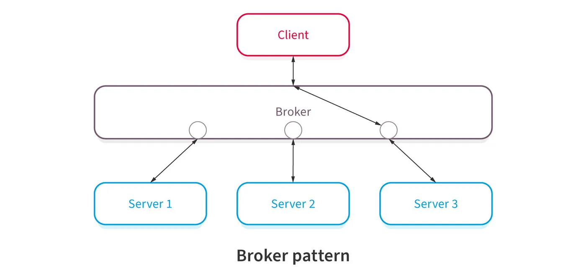

# Broker Pattern

The broker pattern is an architectural pattern that can be used to structure distributed software systems
with decoupled components that interact by remote procedure calls.
A broker component is responsible for coordinating communication, such as forwarding requests,
as well as for transmitting results and exceptions.

Broker Pattern Roles
* Client: access server’s functionality by sending requests to the broker.
* Server: it makes their services available on the broker.
* Broker: find the appropriate server, forward the request and transmit result to client.

Broker pattern has the following characteristics
* A broker component coordinates requests and responses between clients and servers.
* The broker has the details of the servers and the individual services they provide.
* Clients send requests, and the broker finds the right server to route the request to.
* It also sends the responses back to the clients.
